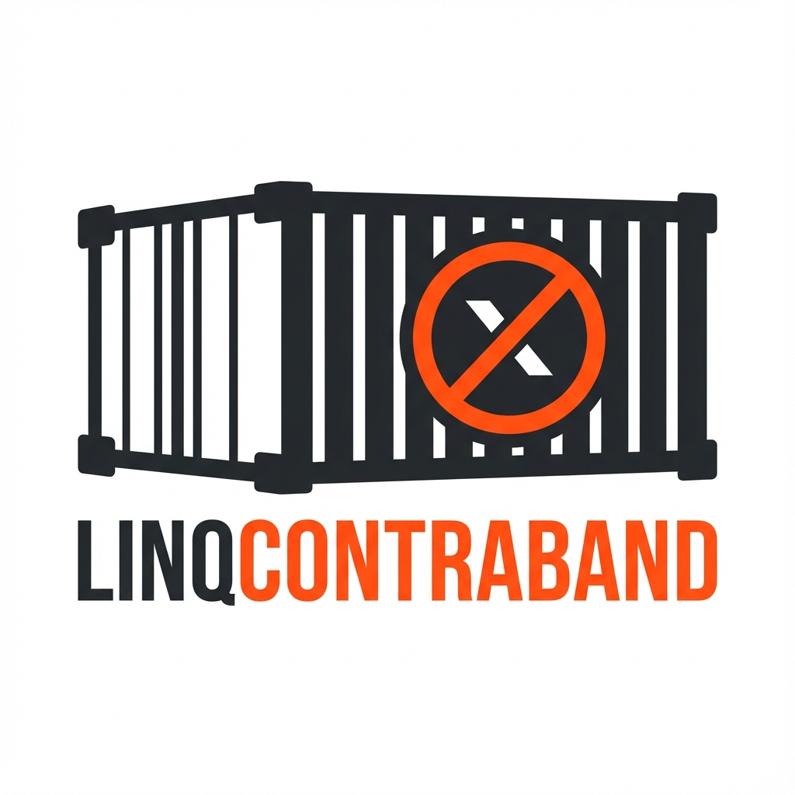

# LinqContraband

<div align="center">



### Stop Smuggling Bad Queries into Production

[](https://www.nuget.org/packages/LinqContraband)
[](https://www.nuget.org/packages/LinqContraband)
[](LICENSE)
[](https://github.com/georgewall/LinqContraband/actions/workflows/dotnet.yml)

</div>

---

**LinqContraband** is the TSA for your Entity Framework Core queries. It's a Roslyn Analyzer that catches performance killers—like client-side evaluation, N+1 risks, and translation failures—at **compile time**, before they crash your production environment.

## 🚀 Installation

Install via NuGet:

```bash
dotnet add package LinqContraband
```

That's it. The analyzer will immediately start scanning your code for contraband.

## 👮‍♂️ The Rules

### LC001: The Local Method Smuggler
Detects usage of local C# methods inside `IQueryable` expressions. EF Core cannot translate these to SQL, leading to runtime exceptions or massive data fetches.

**❌ The Crime:**
```csharp
// CalculateAge is a local C# method. EF Core doesn't know SQL for it.
var query = db.Users.Where(u => CalculateAge(u.Dob) > 18);
```

**✅ The Fix:**
Extract the logic outside the query.
```csharp
var minDob = DateTime.Now.AddYears(-18);
var query = db.Users.Where(u => u.Dob <= minDob);
```

---

### LC002: Premature Materialization
Detects when you filter *after* fetching data. This pulls the entire table into memory before filtering, killing performance.

**❌ The Crime:**
```csharp
// ToList() executes the query (SELECT * FROM Users).
// Where() then filters millions of rows in memory.
var query = db.Users.ToList().Where(u => u.Age > 18);
```

**✅ The Fix:**
Filter on the database, then materialize.
```csharp
// SELECT * FROM Users WHERE Age > 18
var query = db.Users.Where(u => u.Age > 18).ToList();
```

---

### LC003: Prefer Any() over Count() > 0
Detects inefficient existence checks. `Count()` iterates the entire result set, whereas `Any()` stops at the first match.

**❌ The Crime:**
```csharp
// Counts 1,000,000 rows just to see if one exists.
if (db.Users.Count() > 0) { ... }
```

**✅ The Fix:**
```csharp
// Checks IF EXISTS (SELECT 1 ...)
if (db.Users.Any()) { ... }
```

---

### LC004: Guid.NewGuid() in Query
Detects `Guid.NewGuid()` inside queries. This often fails translation or causes client-side evaluation because SQL generates UUIDs differently than C#.

**❌ The Crime:**
```csharp
var query = db.Users.Where(u => u.Id == Guid.NewGuid());
```

**✅ The Fix:**
Generate the value client-side, then pass it in.
```csharp
var newId = Guid.NewGuid();
var query = db.Users.Where(u => u.Id == newId);
```

---

### LC005: Multiple OrderBy Calls
Detects consecutive `OrderBy` calls. The second call completely overwrites the first one, which is rarely what you intended.

**❌ The Crime:**
```csharp
// Sorts by Name, then immediately discards it to sort by Age.
var query = db.Users.OrderBy(u => u.Name).OrderBy(u => u.Age);
```

**✅ The Fix:**
Chain them properly.
```csharp
var query = db.Users.OrderBy(u => u.Name).ThenBy(u => u.Age);
```

## ⚙️ Configuration

You can configure the severity of these rules in your `.editorconfig` file:

```ini
[*.cs]
dotnet_diagnostic.LC001.severity = error
dotnet_diagnostic.LC002.severity = error
dotnet_diagnostic.LC003.severity = warning
```

## 🤝 Contributing

Found a new way to smuggle bad queries? [Open an issue](https://github.com/georgewall/LinqContraband/issues) or submit a PR!

License: [MIT](LICENSE)
